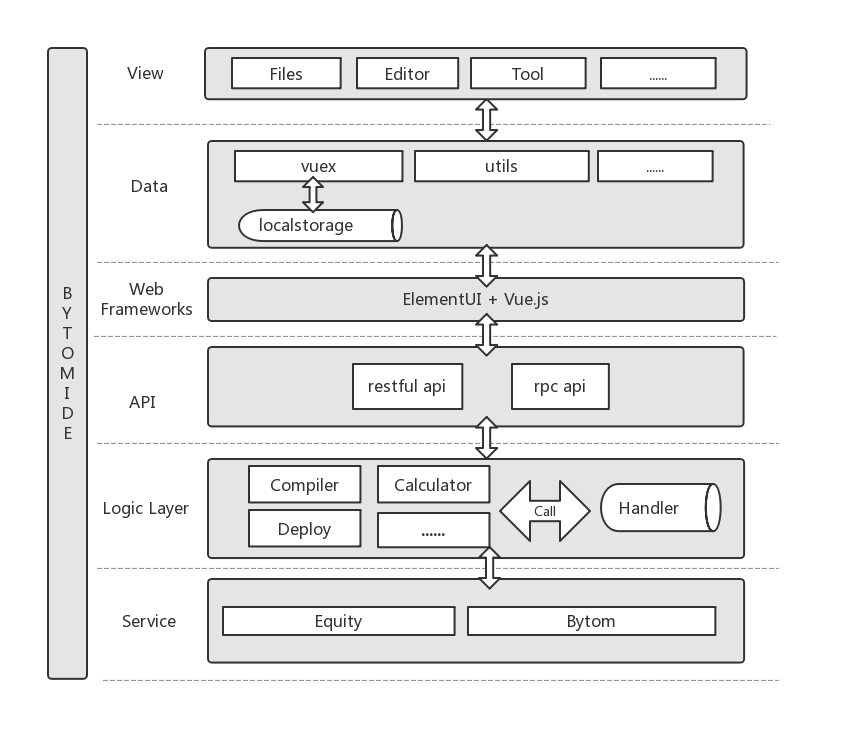

# BytomIDE
This is IDE for Bytom smart contract. This **Bytom IDE** is an online IDE for Equity contract developers. **Bytom IDE** is a code editor and tool to interact with Bytom blockchain. Developers can use the IDE to write equity contract quickly without setting up the whole blockchain development environment. The IDE allows developers to deploy and run their contracts. 

# Requirements

- [Go](https://golang.org/doc/install) version 1.8 or higher, with `$GOPATH` set to your preferred directory
- [Node.js](https://nodejs.org/zh-cn/download/) version 8.11.1 or higher, with `npm` or `yarn`


## Build Setup

Setup IDE frontend with `vue.js`

```
$ cd BytomIDE/ide
```

Install `npm` dependencies

```
$ npm install
# Or install by `yarn`
$ yarn install
```
Build IDE website static directory

```
$ npm run build
#  Or build by `yarn`
$ yarn run build
```
Setup Bytom IDE server

```
$ cd BytomIDE/equity
```

Build 

```
$ go build
```

Run at port as you like, e.g 8080

```
$ ./equity --port=8080
```


## Architecture Diagram




